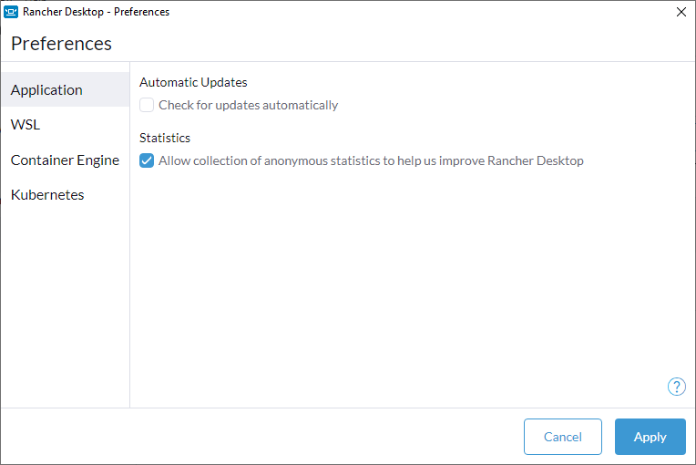
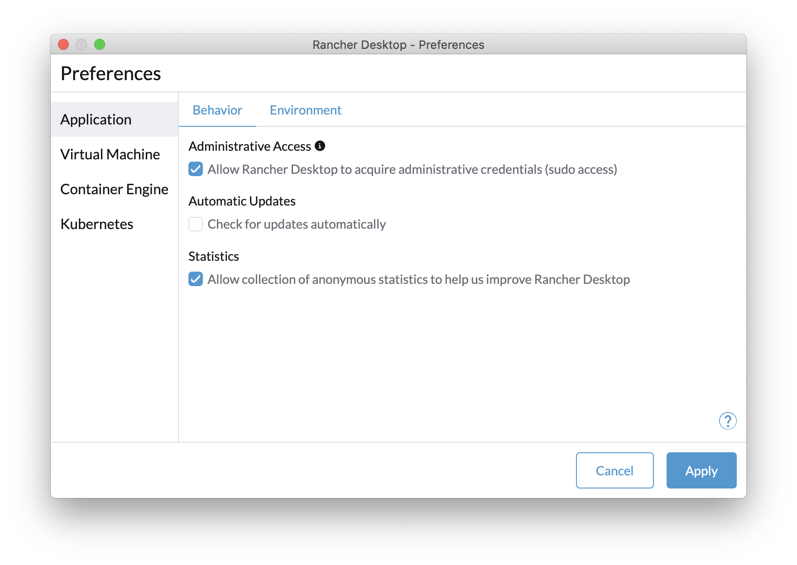
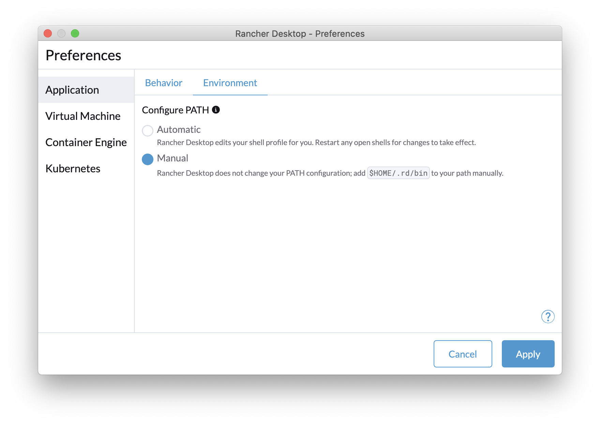
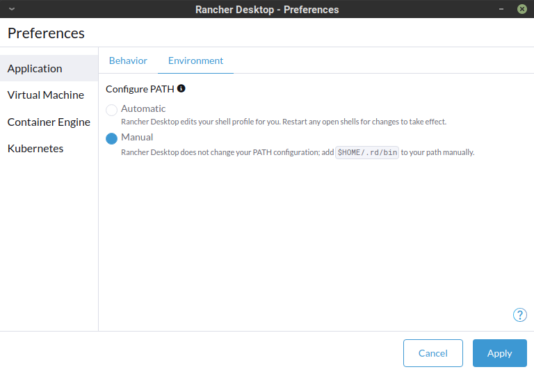

import Tabs from '@theme/Tabs';
import TabItem from '@theme/TabItem';

<Tabs groupId="os">
<TabItem value="Windows">

### Automatic Updates

When an update is available, users are provided a notification and the release notes for the upgrade target. This happens whether automatic updates are enabled or not. If this option is enabled, the update is downloaded and then installed the next time Rancher Desktop is started.

### Statistics

This option allows Rancher Desktop to collect information on how you interact with the Rancher Desktop application. Information such as what workloads you run are not collected.

</TabItem>
<TabItem value="macOS">

### Behavior

#### Administrative Access

Allows Rancher Desktop to acquire administrative access (sudo access) when starting for some operations. This allows for enhanced functionality, including bridged networking and default docker socket support. Changes will only be applied next time Rancher Desktop starts.

#### Automatic Updates

When an update is available, users are provided a notification and the release notes for the upgrade target. This happens whether automatic updates are enabled or not. If this option is enabled, the update is downloaded and then installed the next time Rancher Desktop is started.

#### Statistics

This option allows Rancher Desktop to collect information on how you interact with the Rancher Desktop application. Information such as what workloads you run are not collected.

### Environment

#### Configure PATH

A Rancher Desktop installation comes with command-line utilities that are used to interface with its various features. Some examples of these utilities are `docker`, `nerdctl`, `kubectl`, and `helm`. These utilities are located in `~/.rd/bin` - you may see which utilities are included in your installation by running `ls ~/.rd/bin`.

In order to use the utilities, `~/.rd/bin` must be in the `PATH` variable in your shell.

There are two options for doing this:

- **Automatic**: `PATH` management will add `~/.rd/bin` to your `PATH` by modifying your shell .rc files for you.
- **Manual**: `PATH` management does not change anything - in this mode, you must add `~/.rd/bin` to your `PATH` yourself.

</TabItem>
<TabItem value="Linux">

### Behavior

#### Administrative Access

Allows Rancher Desktop to acquire administrative access (sudo access) when starting for some operations. This allows for enhanced functionality, including bridged networking and default docker socket support. Changes will only be applied next time Rancher Desktop starts.

#### Automatic Updates

When an update is available, users are provided a notification and the release notes for the upgrade target. This happens whether automatic updates are enabled or not. If this option is enabled, the update is downloaded and then installed the next time Rancher Desktop is started.

#### Statistics

This option allows Rancher Desktop to collect information on how you interact with the Rancher Desktop application. Information such as what workloads you run are not collected.

### Environment

#### Configure PATH

A Rancher Desktop installation comes with command-line utilities that are used to interface with its various features. Some examples of these utilities are `docker`, `nerdctl`, `kubectl`, and `helm`. These utilities are located in `~/.rd/bin` - you may see which utilities are included in your installation by running `ls ~/.rd/bin`.

In order to use the utilities, `~/.rd/bin` must be in the `PATH` variable in your shell.

There are two options for doing this:

- **Automatic**: `PATH` management will add `~/.rd/bin` to your `PATH` by modifying your shell .rc files for you.
- **Manual**: `PATH` management does not change anything - in this mode, you must add `~/.rd/bin` to your `PATH` yourself.

</TabItem>
</Tabs>
